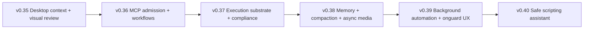

# CapableDeputy — Implementation Roadmap

**Current source of truth.** This is the canonical product roadmap.
`docs/implementation-plan.md` is the engineering sequencing companion that
maps this roadmap onto GitHub issues and dependencies. The older
`docs/improvement-roadmap.md` and `docs/improvement-roadmap-2.md` files are
historical backlog snapshots, not the current roadmap.

**Last refreshed:** 2026-07-01 — v0.38 and v0.39 implementation work is
complete locally, supporting tracks 07-10 have closeout evidence, and v0.40 is
the next product milestone: a safe practical scripting assistant for
non-programmers. Milestone names carry ordered prefixes, open work is
milestone-scoped, and v1.0 remains unscheduled.

## Product Ladder — v0.35 → v0.40

| GitHub milestone | Goal | Spec / tracker |
|---|---|---|
| **01 Product — v0.35.0 — Desktop context, SourcePorts, and visual review** | Desktop context, SourcePorts, and visual review | #146–#152 |
| **02 Product — v0.36.0 — MCP admission, provider mappings, and workflow templates** | MCP admission, provider mappings, and workflow templates | #153–#159, #184–#186 |
| **03 Product — v0.37.0 — Execution substrate, isolation, and compliance evidence** | Execution substrate, isolation, and compliance evidence | #44, #9, #14, #55–#57, #187–#189 |
| **04 Product — v0.38.0 — Memory, retention, compaction, and async media reliability** | Memory, retention, compaction, and async media reliability | #160–#165, #190–#192, #194–#195 |
| **05 Product — v0.39.0 — Background automation and onguard UX** | Background automation and onguard UX | #166–#171 |
| **06 Product — v0.40.0 — Safe practical scripting assistant** (next) | Safe practical scripting for non-programmers | #172–#177 |

## Planned Work Coverage

This pass audited the live GitHub tracker: no open issue is unmilestoned.
The planned work is now grouped as:

| GitHub milestone | Issues | Why it is outside the product ladder |
|---|---|---|
| **07 Support — Source identity and labeling correctness** | #42, #51, #139 | Complete; see `docs/support-track-closeout-2026-07-01.md`. |
| **08 Support — Terminal UX and approval polish** | #16, #17, #19, #27, #29 | Complete for the terminal support track; see `docs/support-track-closeout-2026-07-01.md`. |
| **09 Research — Non-goals and safe alternatives** | #178–#181 | Complete as research decisions; see `docs/support-track-closeout-2026-07-01.md`. |
| **10 Backlog — Formal models and deferred breadth** | #45, #58, #59 | Complete; see `docs/support-track-closeout-2026-07-01.md`. |

### Completed Milestone Names

Closed GitHub milestones use the same ordered-prefix convention:

| GitHub milestone | Status |
|---|---|
| **00.01 Done — v0.17 — Gap hardening and explainability** | Closed |
| **00.02 Done — v0.25.0 — MCP compatibility and security integration** | Closed |
| **00.03 Done — v0.26.0 — Client parity over daemon RPC** | Closed |
| **00.04 Done — v0.27.0 — Practical setup and daemon-owned settings** | Closed |
| **00.05 Done — v0.28.0 — Onguard clients and daemon coordination** | Closed |
| **00.06 Done — v0.29.0 — MCP security conformance and external server labeling** | Closed |
| **00.07 Done — v0.30.0 — Client integration test parity** | Closed |
| **00.08 Done — v0.31.0 — Multi-session security context observability** | Closed |
| **00.09 Done — v0.32.0 — Interactive workstream coordination** | Closed |
| **00.10 Done — v0.33.0 — Streaming turn lifecycle and liveness** | Closed |
| **00.11 Done — v0.34.0 — First-run, connectors, and rich chat readiness** | Closed |

## Completed Focus — v0.34.0 First-run, Connectors, and Rich Chat Readiness

Goal: make a fresh CapDep install practical without YAML handholding while
preserving daemon-owned authority, then make the primary chat surface useful
enough to validate that setup: rich media artifacts, policy-gated image/chart
tools, and explicit local model routing.

The important design constraint stays unchanged: clients may render, request,
configure through approved RPCs, and launch user-visible setup flows, but the
daemon remains the only authority for connector settings, OAuth state,
ownership, labels, policy, approvals, provenance, audit, tool dispatch, model
selection, and turn cancellation.

### v0.34.0 scope

| Issue | Work | Local status |
|---|---|---|
| #140 | EPIC: First-run, connector, rich chat, and local-model readiness without client-side authority | Done locally |
| #141 | Research onboarding flows in Claude Code, Codex, Goose, OpenHands, and desktop agents | Done locally |
| #142 | Daemon setup plan/check RPCs for first-run readiness | Done locally |
| #143 | Connector OAuth readiness tests and guided recovery actions | Done locally |
| #144 | First useful workflow smoke: setup to safe morning briefing | Done locally |
| #145 | Client setup surfaces consume daemon setup plan | Done locally |
| #182 | Rich chat media tools: generated images, fetched images, Wikipedia lead images, and chart artifacts | Done locally |
| #183 | Local model routing and CapDepMac model-mode controls | Done locally |

**Landed so far:** `setup.plan` / `setup.check` / `setup.status` /
`setup.run_action` (`daemon/setup_plan.py`); `connector.status` OAuth
recovery descriptors; CLI `capdep setup plan|check|status`; TUI setup
surface; Swift `SetupAssistantView` + dashboard rows; MCP-control
passthrough; bundled image fetch/generate, Wikipedia lookup, chart artifacts,
semantic media capability kinds, model-selected turn events, and CapDepMac
generated-image rendering guards. Focused tests cover setup, OAuth recovery,
morning briefing, media policy, image generation/fetch routing, chart output,
model routing, streaming events, and Swift chat image parsing/rendering.

**Closeout evidence:** #141 is captured in
`docs/first-run-onboarding-research.md`; #145 is covered by the client parity
manifest, source-level setup action label checks, and CLI/TUI/Swift/MCP-control
setup surfaces. #182/#183 remain backed by focused media/model-routing tests
and CapDepMac rendering/model-mode safeguards.

### v0.34.0 done-when

- The daemon exposes a setup plan/check surface that identifies missing
  connector credentials, OAuth state, model readiness, policy configuration,
  and first workflow readiness.
- CLI, TUI, Swift GUI, and MCP-control consume the same daemon setup plan
  rather than duplicating setup logic.
- Google Workspace/Gmail OAuth readiness has guided recovery actions and
  tests for connected, missing, expired, and misconfigured states.
- A first useful workflow smoke test proves a user can get from setup to a
  safe morning briefing without bypassing policy or daemon ownership.
- Rich chat media artifacts and local model routing are daemon-mediated,
  policy-gated, test-covered, and visible in CapDepMac without trusting
  hallucinated file paths.

## Completed Focus — v0.35.0 Desktop Context SourcePorts and Visual Review

**Depends on:** v0.34 chat/setup readiness. Once the app can guide setup and
produce useful policy-gated turns, the next table-stakes desktop-agent gap is
safe active-context capture and signed reviewable artifacts.

| Issue | Work | Status |
|---|---|---|
| #146 | EPIC: Desktop context SourcePorts and signed visual review | Done locally |
| #147 | Research desktop agent UX for context capture, review cards, and approval fatigue | Done locally |
| #148 | Define active-context SourcePort contract with labels and canonical IDs | Done locally |
| #149 | Browser current-page SourcePort with untrusted-content labeling | Done locally |
| #150 | macOS app SourcePorts for Mail, Finder, Pages, Numbers, Keynote, and Calendar context | Done locally |
| #151 | Typed artifact model for drafts, diffs, calendar mutations, document patches, and research memos | Done locally |
| #152 | Signed approval payloads bind exact artifact hash and destination | Done locally |

**Closeout evidence:** `docs/desktop-agent-ux-rpc-plan.md` captures the
desktop-agent UX/RPC review (#147). Active-context SourcePorts cover browser
current page, frontmost macOS app context, Apple Mail, Finder, Pages, Numbers,
Keynote, and Calendar; they canonicalize stable IDs, label untrusted/browser
and system/app context, and refuse stale or ambiguous inputs. Typed review
artifacts now produce `review_artifact` cards through `artifact.prepare` and
`approval.detail`, and CapDepMac parses/renders those cards. Focused Python and
Swift tests cover SourcePort canonicalization, stale-context failure, daemon
handlers, artifact hashing, signed approval tamper detection, review-card
payloads, and Swift model parsing.

### v0.35.0 done-when

- Active desktop/browser context enters the daemon through labeled SourcePorts,
  not client-local scraping that bypasses policy.
- Proposed changes are typed artifacts with stable hashes and destinations.
- Approval/review cards bind the exact artifact and recipient/action being
  approved.

## Completed Focus — v0.36.0 MCP Admission, Provider Mappings, and Workflow Templates

**Depends on:** v0.35 typed artifacts and review surfaces for safer operator
review of new tools/templates.

| Issue | Work | Status |
|---|---|---|
| #153 | EPIC: MCP adapter, extension admission, and bounded workflow templates | Done locally |
| #154 | Research safe extension managers and skill/template systems in peer agents | Done locally |
| #155 | Daemon MCP extension admission workflow with classify/test/approve/disable | Done locally |
| #156 | Workflow template manifest schema with capabilities, labels, flow pattern, and approval policy | Done locally |
| #157 | Implement starter workflow templates for briefing, inbox triage, meeting prep, and research memo | Done locally |
| #158 | Client workflow-template review and launch surfaces | Done locally |
| #159 | MCP extension and workflow-template conformance tests | Done locally |
| #184 | Generic MCP adapter polish and fail-closed mapping audit | Done locally |
| #185 | Tier-1 MCP mappings: GitHub, Google Workspace, Microsoft 365, and Notion | Done locally |
| #186 | HTTP MCP OAuth flow-pattern sessions and credential mediation | Done locally |

**Closeout evidence:** `docs/mcp-extension-admission-research.md` captures the
extension/template admission model (#154). Workflow templates are validated
manifests with schema version, capabilities, source ports, artifact types, flow
pattern, approval policy, retention, and launch text, including briefing,
inbox triage, meeting prep, and research memo starters. `workflow.launch`
centralizes template review/launch across CLI, TUI, CapDepMac, and MCP-control.
MCP admission now persists preview, approval, disable, list, audit, mapping
fingerprints, and reapproval state in the daemon state database; MCP-control
exposes those operator RPCs. Curated tier-1 mappings cover GitHub, Google
Workspace, Microsoft 365, and Notion with strict fail-closed overrides. HTTP
OAuth helpers now expose redacted credential status and enforce requested
scopes before returning bearer tokens. Focused tests cover manifests, launch,
admission persistence, MCP-control dispatch, OAuth credential mediation,
provider mappings, and client parity.

### v0.36.0 done-when

- New upstream MCP tools are admitted only after explicit mapping,
  classification, conformance tests, and daemon approval.
- Tier-1 MCP mappings cover GitHub, Google Workspace, Microsoft 365, and
  Notion with fail-closed behavior for unmapped tools.
- Workflow templates declare capabilities, labels, flow pattern, and approval
  policy before clients can launch them.
- HTTP MCP OAuth state is daemon-owned and scoped rather than ambient.

## Completed Focus — v0.37.0 Execution Substrate, Isolation, and Compliance Evidence

**Depends on:** v0.36 MCP/template admission. Once external tools are admitted
deliberately, v0.37 hardens their execution substrate and evidence pipeline.

| Issue | Work | Status |
|---|---|---|
| #44 | EPIC: Substrate isolation, execution, and compliance replay | Done |
| #9 | Run upstream MCP servers inside Podman by default | Done |
| #14 | Per-upstream network egress allowlist for stdio upstreams | Done |
| #55 | Cross-host RemoteApprovalEnvelope structured four-axis wire format | Done |
| #56 | More VersionedWritePort backends | Done |
| #57 | Modal + Firecracker SandboxActuators for heavier isolation providers | Done |
| #187 | `EXECUTE.sandbox` `code.execute` native tool over Podman `SandboxActuator` | Done |
| #188 | OTLP exporter, OSCAL assessment plan, and compliance audit-replay pipeline | Done |
| #189 | Meta-director and ToxicSkills regression scenarios for MCP/substrate safety | Done |

### v0.37.0 implementation notes

- `upstream_isolation_defaults` now applies Podman isolation to stdio upstreams
  unless an entry declares its own profile or explicitly opts out; bridge mode
  requires `allowed_hosts` and disables container DNS resolution.
- `sandbox.run` is joined by `code.execute`, both on the same
  `SandboxActuator` lifecycle/audit path.
- `VersionedWritePort` has S3 Object Lock and Google Drive revision providers
  alongside git.
- Remote approvals carry `capdep.remote-approval.v1` plus structured four-axis
  wire fields covered by the signature.
- Compliance now emits OSCAL assessment plans, OTLP trace JSON, and replay
  reports that flag unmapped policy decisions and undiscarded sandbox regions.
- Modal and Firecracker command-runner actuators implement the same port as
  Podman without introducing a second policy authority.
- Adversarial MCP regressions cover meta-director prompt injection and
  ToxicSkills metadata smuggling.

### v0.37.0 done-when

- Upstream MCP stdio servers can run with Podman isolation and declared network
  egress allowlists.
- `EXECUTE.sandbox` exposes useful bounded execution without treating
  containment as declassification.
- OTLP export, OSCAL assessment artifacts, and audit replay are
  operator-runnable.
- Modal/Firecracker and VersionedWritePort providers extend the same substrate
  ports without weakening daemon policy.

## Completed Focus — v0.38.0 Memory, Retention, Compaction, and Async Media Reliability

**Depends on:** v0.37 substrate/compliance closure. v0.38 makes long-running
conversation state durable and auditable, then folds rich-media follow-up into
the same work so CapDepMac no longer depends on model-authored markdown or
happy-path event ordering.

| Issue | Work | Status |
|---|---|---|
| #160 | EPIC: Mature retention, memory controls, and context compaction | Done locally |
| #161 | Research: retention, session storage, compaction, and memory controls in peer agents | Done locally |
| #162 | Daemon retention policy and maintenance RPCs | Done locally |
| #163 | Memory trust classes and user-visible memory controls | Done locally |
| #164 | Context compaction as labeled summary artifacts | Done locally |
| #165 | Retention and memory management client surfaces | Done locally |
| #190 | EPIC: Reliable async rich-media chat attachments in CapDepMac | Done locally |
| #191 | Codify verified CapDepMac daemon launch and post-open parity checks | Done locally |
| #192 | Fail closed when generated-image tools are unavailable | Done locally |
| #194 | Render daemon `image_attachment` events as durable CapDepMac chat parts | Done locally |
| #195 | Retry pending local image resolution before permanent CapDepMac fallback | Done locally |

**Closeout evidence:** `memory.policy`, `memory.prune`, and
`memory.compact_session` expose daemon-owned retention/compaction controls.
Memory entries carry timestamps and trust classes, and compaction stores a
labeled derived-summary artifact. Generated-image intent now fails closed when
no visible generated-image tool exists. Turn lifecycle results expose
`image_attachments`, terminal event ordering preserves attachment events, and
CapDepMac preserves structured image snippets during final response
finalization. Local launch scripts now verify daemon parity after app open.

### v0.38.0 implementation notes

- Conversation memory and compaction work should preserve source labels,
  approval provenance, and audit evidence instead of flattening history into
  untrusted summaries.
- Rich-media follow-up is not a new product pillar; it is a hardening pass on
  v0.34 media now that traces show model-authored image markdown can race or
  hallucinate when tools are unavailable.
- CapDepMac launch success must mean the app is open and daemon parity still
  passes after launch, not merely that Swift built or the app process exists.
- Generated/fetched images should become durable daemon-backed chat parts keyed
  by turn/session, with markdown treated as display sugar only when backed by a
  real tool result.

### v0.38.0 done-when

- Retention policies and maintenance RPCs let users inspect, compact, and prune
  daemon-owned state without bypassing labels or audit.
- Compaction emits labeled summary artifacts with reviewable provenance.
- Memory controls are visible in CLI/TUI/CapDepMac where appropriate.
- CapDepMac displays generated/fetched images from structured daemon attachment
  events and preserves them across finalization and reload.
- Generated-image intent fails closed when the image tool is unavailable, rather
  than letting the model invent local paths.
- Local image resolution tolerates short file-visibility delays without hiding
  real missing-file errors.

## Completed Focus — v0.39.0 Background Automation and Onguard UX

| Issue | Work | Status |
|---|---|---|
| #166 | EPIC: Background automation UX for onguard clients | Done locally |
| #167 | Research background agent notifications, approval queues, and low-fatigue UX | Done locally |
| #168 | Daemon notification/event contract for onguard results and approval-needed states | Done locally |
| #169 | Swift/macOS notification integration as a thin client | Done locally |
| #170 | Approval digest and timeout UX for queued background actions | Done locally |
| #171 | Onguard result handoff to interactive sessions | Done locally |

**Closeout evidence:** daemon RPCs now expose `onguard.notifications.contract`,
`onguard.notifications.list`, `onguard.approval_digest`, and `artifact.handoff`.
The CLI has `capdep onguard notifications`, `approval-digest`, and `handoff`.
CapDepMac parses daemon notification summaries and schedules local
notifications using daemon event IDs as dedupe identifiers. Handoff sessions
preserve origin metadata, artifact ID, labels, provenance, and payload content.

## Later Product Milestones

| Milestone | Work | Issues |
|---|---|---|
| v0.39 | Background automation and onguard UX | #166–#171 |
| v0.40 | Safe practical scripting assistant | #172–#177 |

## Completed Focus — v0.33.0 Streaming Turn Lifecycle and Liveness

Goal: make long-running interactive turns cancellable, observable, and safe
across multiple local clients. v0.33 added the daemon-owned turn lifecycle
underneath workstream ownership: streaming events, heartbeat acknowledgements,
cancellation on disconnect, partial-turn persistence, slow-consumer replay, and
reduced stdio upstream credential exposure.

### v0.33.0 completed scope

| Issue | Work | Status |
|---|---|---|
| #31 | Cancel in-flight turn when client surface disconnects | Done |
| #32 | UI heartbeat: cancel agent loop when surface stops responding | Done |
| #22 | Inline streaming agent output via Rich Live | Done |
| #13 | Credential vault residual: no broad environment inheritance for long-lived tools | Done |

Stdio MCP upstreams still receive secrets explicitly granted to that server at
spawn time because stdio MCP servers are long-lived processes. The completed
hardening prevents unrelated daemon environment secrets from being inherited;
true per-dispatch stdio secret materialization requires per-call isolation or
a server-specific auth channel.

## Completed Focus — v0.32.0 Interactive Workstream Coordination

Goal: make multi-client interactive work safe, inspectable, and practical.
The daemon is now the only authority for active workstream ownership and
related coordination state. Clients can request control and render state, but
owner-only send/cancel behavior is enforced in daemon handlers.

### v0.32.0 completed scope

| Issue | Work | Status |
|---|---|---|
| #137 | EPIC: Interactive workstream coordination and daemon state observability | Done |
| #136 | Add `daemon.state` and `workstream.*` RPCs to the client parity contract | Done |
| #134 | Expose workstream ownership and daemon state in interactive clients | Done |
| #133 | Harden workstream lease expiry, reconnect, takeover, and cancellation semantics | Done |
| #138 | Add coordinated multi-client daemon integration and torture tests | Done |

True mid-RPC disconnect and heartbeat cancellation were intentionally moved to
v0.33 because the existing IPC path is one-shot request/response. Treating a
normal closed one-shot socket as a stale client would incorrectly retire every
ordinary RPC call.

## Parallel Tracks and Backlog

(v0.35 through v0.40 are sequenced above as the active product ladder; they
are not backlog. The tracks below remain planned work, but they are
cross-cutting, supporting, research, or deliberately deferred.)

### 07 Support — Source Identity and Labeling Correctness

The old v0.16 policy-expressiveness milestone is now narrowed to the labeling
oracle. The DecisionInspector/Starlark layer is live and its old parent issue
is closed; remaining work improves correctness at ingress and source identity
boundaries.

| Issue | Work | Status |
|---|---|---|
| #42 | EPIC: Strengthen the labeling oracle | Done locally |
| #51 | Gmail / Drive / Calendar SourcePort canonical-id providers | Done locally |
| #139 | Email labeler implementation — rule file plus per-message hook | Done locally |

### 08 Support — Terminal UX and Approval Polish

The old v0.5 UX milestone is now terminal-client polish, not the whole product
UX strategy and not daemon safety substrate. Streaming moved to v0.33. The
remaining issues should stay practical and should not duplicate daemon
authority.

| Issue | Work | Status |
|---|---|---|
| #16 | REPL feature parity with Claude Code | Done locally |
| #17 | Split-pane / tabbed viewer for significant content alongside chat | Done locally as support-track scope; full terminal workspace is not a product-ladder blocker |
| #19 | Inline graphics via sixel / kitty graphics protocol | Done locally |
| #27 | Inline approval as non-blocking banner | Done locally |
| #29 | Unicode width safety in bottom toolbar + 80x24 minimum size | Done locally |

### 09 Research — Non-Goals and Safe Alternatives

These issues keep important product-pressure topics visible without turning
them into immediate implementation commitments.

| Issue | Work | Status |
|---|---|---|
| #178 | Alternatives to remote/mobile daemon control without opening network listeners | Done locally |
| #179 | Alternatives to broad always-on autonomous action modes | Done locally |
| #180 | Safe community template/extension sharing without marketplace trust collapse | Done locally |
| #181 | Web UI or cross-platform GUI alternatives without duplicating daemon functionality | Done locally |

### 10 Backlog — Formal Models and Deferred Breadth

Backlog remains intentionally lower priority than the v0.35-v0.40 product
ladder and the source-identity/labeling track. It is grouped by why it is
deferred:

- Formal-model completeness beyond current practical enforcement: #45, #58,
  #59 are done locally; see `docs/support-track-closeout-2026-07-01.md`.
- Any remaining provider or federation breadth not explicitly pulled into
  v0.36/v0.37.

## Completed Focus — v0.26.0 Client Parity Over Daemon RPC

Goal: every client should expose the daemon functionality appropriate for its
surface while preserving the daemon as the single owner of policy, approvals,
provenance, connector setup, settings, and audit. Parity does **not** mean
every client exposes every RPC blindly; it means every daemon method has an
explicit support decision for CLI, TUI, Swift GUI, and MCP-control.

### v0.26.0 client parity scope

| Issue | Work | Status |
|---|---|---|
| #90 | Define client parity contract for daemon RPC surfaces | Done |
| #89 | Bring CLI to full daemon operator parity | Done |
| #84 | Bring TUI to live-supervision parity with core daemon workflows | Done |
| #91 | Bring Swift macOS GUI to desktop assistant parity | Done |
| #85 | Bring MCP-control client to automation parity with daemon-safe operations | Done |
| #88 | Add automated client parity tests and documentation | Done |

### v0.26.0 done-when

- `docs/client-parity.json` covers every daemon RPC method and states whether
  each client implements it, intentionally omits it, or treats it as
  surface-specific.
- Tests fail when a daemon RPC is added without a parity decision.
- CLI exposes the broad non-visual operator/admin surface.
- TUI exposes live-supervision controls without becoming an admin/config
  console.
- Swift GUI exposes desktop-assistant operations through daemon-backed model
  methods.
- MCP-control exposes automation-safe daemon operations as MCP tools while
  routing dangerous work through daemon policy and approvals.

## Next Focus — v0.28.0 Onguard Clients + Daemon Coordination

Goal: make headless background work extensible without making the daemon a
giant application server. Onguard clients are normal daemon clients that claim
approved schedules/queues, while the daemon owns identity, origin metadata,
shared config, queues, events/results, schedules, labels, provenance, audit,
and policy enforcement.

### v0.28.0 onguard scope

| Issue | Work | Status |
|---|---|---|
| #92 | EPIC: Onguard clients and daemon coordination substrate | Done |
| #93 | Structured origin metadata for sessions, policy, audit, and Starlark | Done |
| #94 | Daemon client registry for onguard client identity and admission | Done |
| #95 | Daemon-owned client config store with proposal and approval states | Done |
| #96 | Daemon client command queue with leases, labels, and provenance | Done |
| #97 | Daemon client events/results and artifact store for background work | Done |
| #98 | Daemon scheduler contracts with recurrence, leases, and run history | Done |
| #99 | Onguard policy and Starlark starter rules | Done |
| #100 | Onguard client runtime and CLI runner | Done |
| #101 | Daily newspaper digest onguard client and interest profile | Done: deterministic preview artifact |
| #102 | Client parity for schedules, queues, config, events, and artifacts | Done: CLI read paths, TUI/Swift read-only operator views, MCP-control full coordination |
| #103 | Onguard security demos and violation tests | Done: finance quarantine and deterministic deny tests |
| #104 | Inbox triage onguard client | Done: deterministic preview artifact |
| #105 | Meeting prep onguard client | Done: deterministic preview artifact |
| #106 | Watch-folder and downloads processor onguard client | Done: recommendation artifact, no file mutation |
| #107 | Personal knowledge update onguard client | Done: low-integrity candidate artifact |
| #108 | Task follow-up onguard client | Done: deterministic preview artifact |
| #109 | Research monitor onguard client | Done: labeled result artifact |
| #110 | Local desktop automation monitor onguard client | Done: observation artifact, no app control |
| #111 | Finance document guard onguard client | Done: untrusted finance quarantine |
| #112 | Deterministic onguard approval/denial clients and examples | Done: explicit-rule deny-only sweep |

## Follow-On Focus — v0.29.0 MCP Security Conformance + External Server Labeling

Goal: turn the current targeted MCP tests into a comprehensive conformance
suite proving that MCP cannot become a second authority path. This is
prioritized after the onguard substrate because onguard clients will rely on
external MCP servers, resources, prompts, and control surfaces.

### v0.29.0 MCP conformance scope

| Issue | Work | Status |
|---|---|---|
| #113 | EPIC: MCP security conformance and external server labeling | Done |
| #114 | Reusable MCP conformance fixture harness | Done |
| #115 | Session-bound MCP multi-turn labels, approvals, provenance, and audit | Covered by existing MCP/control/resource tests plus conformance harness |
| #116 | Upstream MCP tool classification, target extraction, and fail-closed labeling | Done |
| #117 | Upstream MCP resources and prompts as labeled inputs | Done for resources; prompt surface remains static/workflow scoped |
| #118 | MCP-control and admin MCP separation, authority boundaries, and audit | Done |
| #119 | Opt-in real MCP server smoke matrix for common external servers | Done: skipped-by-default `CAPDEP_REAL_MCP_SMOKE_CONFIG` matrix |

### v0.29.0 done-when

- Fake malicious/ambiguous MCP servers cannot register unsafe tools or content
  without fail-closed classification.
- Upstream MCP tool/resource/prompt content carries labels and provenance into
  the session before later tool calls.
- MCP-control and admin MCP remain client surfaces that forward daemon RPCs;
  they do not mutate authority outside daemon policy, approvals, provenance, or
  audit.
- Optional real-server smoke tests cover common external MCP integrations
  without making deterministic CI depend on network services.

## Follow-On Focus — v0.30.0 Client Integration Test Parity

Goal: move client parity from source/manifest checks to live daemon integration
tests. Parity still means explicit support decisions per client, not blindly
exposing every RPC everywhere.

### v0.30.0 client integration scope

| Issue | Work | Status |
|---|---|---|
| #120 | EPIC: Client integration test parity across CLI, TUI, Swift GUI, and MCP-control | Done |
| #121 | Shared daemon integration fixtures for client parity tests | Done |
| #122 | CLI live-daemon integration tests for core operator workflows | Done for onguard read paths |
| #123 | TUI live-daemon integration and regression tests | Done: console and spectator live-daemon smoke |
| #124 | Swift GUI daemon-contract and UI action tests | Done: SwiftPM daemon-contract model tests; macOS UI smoke stays opt-in |
| #125 | MCP-control live-daemon integration tests | Done for onguard control paths |
| #126 | CI test tiers for client and MCP coverage | Documented locally |

### v0.30.0 done-when

- Every implemented client path has at least one automated test proving it calls
  daemon contracts rather than duplicating safety logic.
- CLI, TUI, Swift GUI, and MCP-control tests share daemon fixtures where
  possible.
- CI distinguishes deterministic, live-daemon, macOS GUI-sensitive, and
  external/network MCP test tiers.

### v0.30.0 current implementation status

- Shared `tests/daemon_integration.py` builds a real test daemon with the
  production handler surface and short macOS-safe Unix socket paths.
- MCP-control now has live-daemon coverage for onguard registry, schedule, and
  queue operations; the test caught and fixed a schedule-create contract drift.
- CLI now exposes read-only `capdep onguard clients|queue|schedules|artifacts`
  commands and tests them against the live daemon.
- TUI console and spectator surfaces mount against a live daemon in deterministic
  integration tests; refresh teardown now tolerates the app closing while a
  daemon RPC is returning.
- `docs/testing.md` defines deterministic, live-daemon, macOS GUI-sensitive,
  external MCP smoke, and coverage-ratchet tiers.

## Follow-On Focus — v0.31.0 Multi-Session Security Context Observability

Goal: make multi-turn safety inspectable. A user or external controller should
be able to ask what security models, flow patterns, labels, external MCP
servers, tools, onguard clients, approvals, policy rules, and provenance are
active in a session and why a decision was made.

### v0.31.0 security context scope

| Issue | Work | Status |
|---|---|---|
| #127 | EPIC: Multi-session security context and external actor observability | Done |
| #128 | Daemon `session.security_context` model and RPCs | Done |
| #129 | Session security event ledger and provenance index across turns | Done via audit/provenance projection |
| #130 | Policy and Starlark context with actor, flow, and external-tool metadata | Done: origin, tool, effect, external actor, and flow metadata exposed to scripts |
| #131 | Expose session security context across all clients | Done: CLI, TUI, Swift GUI inspector, and MCP-control |
| #132 | Multi-session external-actor regression tests for security context | Done for onguard, approvals, policy, provenance, CLI, TUI, and MCP-control |

### v0.31.0 done-when

- The daemon can produce a stable security-context JSON view for each session.
- The view explains labels, capabilities, flow pattern, policy/Starlark rules,
  external MCP servers/tools/resources, onguard origins, approvals, provenance,
  and audit evidence.
- CLI, TUI, Swift GUI, and MCP-control render the daemon view instead of
  reconstructing security state independently.
- Regression tests cover multiple sessions, external MCP input, onguard queued
  work, delayed approvals, approval timeouts, and blocked egress.

### v0.31.0 current implementation status

- Daemon exposes `session.security_context` as a stable JSON projection of
  session metadata, labels, capabilities, origin, approvals, policy decisions,
  materialized provenance, audit evidence, onguard actors, and external-tool
  actors.
- CLI exposes `capdep session security-context SESSION_ID` with `--json` and a
  read-only `--socket` override for integration tests and alternate daemons.
- TUI spectator trace uses the daemon security context when available and falls
  back to older `session.get` data for compatibility with older daemons/test
  doubles.
- Swift GUI inspector loads `session.security_context` for selected sessions
  and renders labels, capabilities, policy, provenance, actors, security
  models, flow patterns, and limitations from the daemon-owned projection.
- MCP-control exposes `session_security_context` as a read-only daemon
  passthrough.
- Regression coverage includes direct daemon projection, MCP-control dispatch,
  live-daemon CLI/MCP parity, and existing TUI session-detail behavior.

## Previous Focus — v0.25.0 MCP Compatibility + Security Integration

Goal: make MCP a well-specified integration substrate for CapDep without
letting MCP become a second authority path. The daemon remains the security
owner; session-bound MCP, admin MCP, and upstream MCP servers all route through
explicit daemon contracts.

### Landed in v0.24.0

- Native CapDepMac app bundle runner and single-instance guard.
- GUI daemon supervision, stale-daemon recovery, and local launcher hardening.
- Default daemon idle shutdown when no clients remain connected.
- Durable daemon memory in the SQLite state DB.
- Daemon-backed Gmail MCP OAuth setup: OAuth client storage, generated
  `servers.d/google-gmail.yaml`, browser OAuth login, audit events, and
  CapDepMac Accounts UI wiring.

### v0.25.0 MCP milestone scope

| Issue | Work | Status |
|---|---|---|
| #77 | MCP compatibility matrix and protocol tests | Done |
| #78 | Add `outputSchema` to CapDep MCP tools | Done |
| #79 | Unify MCP elicitation with daemon approval objects | Done |
| #80 | Make upstream MCP resources first-class labeled inputs | Done |
| #81 | Define explicit policy posture for every MCP surface | Done |
| #82 | Strengthen admin MCP server separation and audit | Done |
| #83 | Refresh MCP and ARD documentation against implementation | Done |

### v0.25.0 done-when

- Session-bound MCP exposes schemas, metadata, approval behavior, and resource
  behavior that match the daemon contract.
- Upstream MCP tools/resources preserve capability, label, and provenance
  posture instead of bypassing the policy engine.
- Admin MCP remains separate from normal session MCP and is marked as local
  setup authority.
- ARD is documented as operator-curated discovery only, not runtime execution.

### Recommended implementation order

1. Keep the daemon as the only authority for MCP action execution.
2. Add schema metadata and protocol compatibility tests.
3. Unify MCP elicitation with daemon approval objects.
4. Treat upstream MCP resources as labeled inputs.
5. Document explicit posture for every MCP surface and ARD.

---

This roadmap accompanies DESIGN.md. Phases marked **DONE** are landed
on `main` with the listed commit; **IN PROGRESS** is partial; **PLANNED**
is upcoming. Phases assume the testing strategy described in §12 of
DESIGN.md and the trace/observability model described in §9.

## v0.1 — Core Runtime

### Phase 0 — Foundations  ·  **DONE** (`fa141f3`)
- Repository scaffold, proprietary (All Rights Reserved) license, code-of-conduct, contributing guide.
- CI: lint (ruff), type-check (pyright), test (pytest), coverage tracking.
- Daemon skeleton: Unix socket listener, JSON-RPC plumbing.
- CLI skeleton: `capdep daemon start/stop/status` and `capdep version`.

**Done-when criteria met**: `capdep daemon start` listens on the socket;
`capdep version` round-trips; CI green.

### Phase 1 — Session Graph & Audit  ·  **DONE** (`da09542` 1a, `d3e3f52` 1b, `4d50190` 1c, `aa1ca2a` 1d, `b8bc510` polish)
- `Session`, `SessionGraph` data model.
- Fork / pause / resume operations (no merge yet).
- SQLite persistence + load on startup.
- Audit log writer (JSONL, append-only, fsync per write).
- Full event taxonomy from DESIGN.md §9.2 wired in from day one.
- `capdep session list/new/fork/pause/resume`.
- `capdep audit` and `capdep watch` minimal viable forms.
- Property-based tests for graph invariants (Hypothesis).
- Env-overridable paths (`CAPDEP_SOCKET`, `CAPDEP_STATE_DB`, `CAPDEP_AUDIT_LOG`, `CAPDEP_DATA_DIR`) so container deployment is configuration, not refactor.

**Done-when criteria met**: sessions persist across daemon restarts;
fork/pause/resume work end-to-end; every operation produces audit
events conforming to the trace schema.

### Phase 2 — Labels, Capabilities, Policy  ·  **DONE** (`03db5e3` 2a, `9ad94af` 2b, `67009d1` 2c, `c4a443b` 2d)
- 8-label MVP set; `Capability`, `Action` data types; `Decision` enum.
- 4 Brewer-Nash conflict rules (rule 5 deferred to per-arg dispatch layer).
- `decide(label_set, capabilities, action) → PolicyDecision` as a pure
  function; exhaustive parametrized test matrix.
- Session migration to use real `Label` and `Capability` types.
- `capdep policy show/validate/test` CLI with colored decisions.

**Done-when criteria met**: a CLI command can simulate a decision
deterministically; the policy is exhaustively unit-tested across rule
firings and non-firings.

### Phase 3 — Tool Registry, Dispatcher, Native Tools  ·  **DONE** (`374a46a` 3a, `ba14bcb` 3b, `b87b81c` 3c, `dd1dd85` 3d)
- `ToolDefinition` / `ToolRegistry` / `ToolHandler` with `ToolContext`
  and `ToolResult` carrying labels.
- `LabeledToolClient` — single chokepoint for tool dispatch; checks
  policy, dispatches handler, propagates labels into session, emits
  the full §9.2 event sequence.
- Native tools: `memory.read` / `memory.write` (labeled in-process
  store), `purchase.queue` (Clark-Wilson stub), and (added in 5b)
  `email.send` (stub outbox).
- `tool.list/show/test/call` daemon RPCs; `capdep tool` CLI.
- App composition wires native tools into the registry on startup.

**Note**: real upstream MCP server integration (Filesystem, Fetch,
Gmail, etc. via subprocess) is deferred — the Tool abstraction is
correct shape but subprocess management of upstream `mcp`-SDK servers
is a separable future phase. The existing CapableDeputy MCP server
(see Phase 4.5b) goes the *other* direction (capdep as MCP server).

**Done-when criteria met**: tool calls through the wrapper are
intercepted, gated, labeled; results propagate labels correctly;
CI passes with no network access.

### Phase 4 — Turn-Level Mode + LLM Loop  ·  **DONE** (`a6a3601` 4a, `200abfd` 4b, `58d3c7f` 4c)
- LLM types (Message, ToolCall, LLMResponse), `LLMClient` Protocol,
  `FakeLLMClient` for deterministic tests.
- Turn-level agent loop with label accumulation and gated dispatch.
- `LiteLLMClient` (production); LiteLLM-side tool name sanitization
  for Anthropic API compatibility.
- `capdep send <session> "<message>"` CLI command.
- `session.send` daemon RPC and `session.grant_capability`.
- E2E prescription scenario test (FakeLLMClient driving the
  health-meets-egress denial).

**Done-when criteria met**: a (replayed) LLM drives a session,
accumulates labels from tool results, and gets blocked at the correct
egress attempt — verified end-to-end via `session.send`, the
LabeledToolClient, the policy engine, and the audit log.

### Phase 4.5 — Real-LLM testing & MCP server  ·  **DONE** (`b49ffc3` 4.5a, `d487110` 4.5b, `d4a2379` 4.5c, `61022b5` 4.5d)

Originally not on the roadmap; added during Phase 4 as the natural
follow-on once the agent loop existed.

- `tool.call` daemon RPC for direct dispatch (4.5a).
- **MCP server** (`capdep mcp-server`) exposing the labeled tools to
  external MCP hosts like Claude Code. Stdio transport; tool calls
  forwarded through `tool.call` so policy + audit apply identically
  whether the agent loop is internal or external (4.5b).
- `ClaudeCodeLLMClient` (subprocess to `claude -p --output-format
  json`) for subscription-backed development without API keys (4.5c).
- Real-LLM integration tests against `claude-haiku-4-5` (gated on
  `ANTHROPIC_API_KEY`); fixed two real bugs (tool name sanitization,
  empty parameters_schema) found through real-LLM driving (4.5d).

**Done-when**: real Claude correctly identifies and explains the
fired rule on a structurally denied egress attempt.

### Phase 5 — Approval System  ·  **DONE** (`ac1ad0b` 5a, `14d9841` 5b, `cba4737` 5c)
- `ApprovalRequest` model + `ApprovalQueue` with submit / approve /
  deny / defer lifecycle and full audit emission.
- Cross-session declassification: approving SEND_EMAIL spawns a
  fresh purpose-limited session with a one-shot capability scoped
  exactly to the approved payload + recipient; dispatches via
  `LabeledToolClient`; aborts the purpose session.
- `email.send` native tool stub (outbox records sends for audit).
- `approval.list/show/submit/approve/deny/defer` daemon RPCs.
- `capdep approval` CLI subcommand.
- `capdep trace <session>` CLI with colored policy-decision output.
- E2E prescription-to-wife test verifies the full chain (block →
  submit → approve → execute in C → outbox has exactly one mail to
  the right recipient → original session still labeled).

**Note**: full TUI was deferred to Phase 7d. The CLI surface covers
the operational path completely.

**Done-when criteria met**: prescription-to-wife scenario runs
cleanly through the CLI: blocked, surfaced as approval, approved,
executed in a one-shot session, fully traceable.

### Phase 6 — Dual-LLM Mode  ·  **DONE** (`1f7217f`)
- `quarantined/schemas.py`: Pydantic models for the starter set
  (DoseSummary, FinancialSummary, ContactInfo) with bounded field
  lengths to limit smuggling.
- `quarantined/extractor.py`: extract through a quarantined LLM
  with no tools; reject tool_call attempts; strip markdown fences;
  validate via Pydantic.
- `quarantined.extract` native tool with NO additional_labels and
  NO inherent_labels — schema validation IS the declassification.
- App takes optional `quarantined_llm` parameter (falls back to
  `llm_client`).
- E2E test asserts the planner LLM's recorded conversation context
  provably never contained the raw labeled text.

**Done-when criteria met**: extraction-style requests run through
the dual-LLM path; the planner LLM's recorded context provably
never contains the underlying labeled data.

### Phase 7 — Mode Dispatcher, Visibility, Pattern Rules, TUI, MCP Polish  ·  **DONE** (`10c34e0` 7a, `919ac3d` 7b, `5bc1911` 7c, `4e158e6` 7d, `45c3ddc` + `0e47992` 7e, `721f347` 7f)

Compiled deferred work that turned out to be both achievable and
high-leverage in v0.1.

- **7a — Execution mode dispatcher**: `select_mode(label_set,
  registry)` auto-escalates to dual-LLM when the session carries any
  confidential.* label and a quarantined extractor is registered.
  Logged as `mode.selected` audit event. In dual-LLM mode,
  `build_tool_descriptions` hides raw labeled-data readers
  (memory.read, fs.read, web.fetch).
- **7b — Capability-driven tool visibility**: a tool is visible to
  the LLM only if the calling session holds at least one capability
  whose kind matches the tool's `capability_kind`. Defense-in-depth
  on top of the per-call capability check; also stops leaking
  knowledge of out-of-scope tools into the LLM's prompt.
- **7c — Pattern approval rules**: `ApprovalPatternRule` with strict
  validation (rejects bare `*`, requires domain anchors for globs,
  caps TTL at 30 days). Auto-approves matching future requests but
  still emits the full `approval.requested` + `approval.approved`
  audit pair. Revocable instantly.
- **7d — Textual TUI**: `capdep tui` minimum viable Textual app.
  Three panes (Sessions, Approvals, Events), approval modal with
  verbatim payload rendering (DESIGN.md §8.2 hard rule). Polls daemon
  every 1.5s. Full session-graph view, trace pane, and pattern-rule
  editor moved to v0.2.
- **7e — Pattern rule daemon RPCs and CLI**: `approval_pattern.list/
  create/revoke` RPCs and `capdep approval pattern` CLI subcommand.
- **7f — MCP spec compliance review**: audited mcp_server.py against
  modelcontextprotocol.io 2025-11-25; fixed `inputSchema` bug; added
  `isError`, `structuredContent`, `ToolAnnotations`,
  `_meta` (capability_kind, inherent_labels, decision, rule, labels);
  documented full coverage map in `docs/mcp-spec-review.md`.

### Phase 8 (Programmatic Mode)  ·  **IN v0.3** (see below)
- Originally specified as a forked `starlark-py`; revised to a
  Python-AST-subset interpreter (LLMs already write Python natively;
  the AST subset is statically analyzable; ~10× less code than a
  full Starlark fork while preserving security properties). See
  v0.3 entry below for shipped commit.

### Phase 9 (originally Polish)  ·  **PARTIALLY DONE**

- **DONE**: README with canonical use cases (`README.md`),
  CONTRIBUTING.md, CODE_OF_CONDUCT.md, MCP spec review
  (`docs/mcp-spec-review.md`), nine end-to-end demo walkthroughs
  spanning security and assistant workflows
  (`docs/demos/01-prescription-to-wife.md` through
  `docs/demos/09-accountant.md`), mkdocs site scaffold, v0.1.0 + v0.4.0
  release tags.
- **NOT DONE**: asciicasts / demo videos (require terminal recording).

## v0.1 status summary

**Built and verified end-to-end:**
- Phases 0–7 complete (with Phase 8 / Programmatic deferred).
- 317 unit tests + 2 integration tests, all passing.
- 100% coverage on every security-critical module (policy engine,
  conflict rules, capabilities, labels, actions, session graph,
  session model, store, app, paths, all daemon handlers, mode
  dispatcher, approval queue, approval pattern).
- Real-LLM integration test (`claude-haiku-4-5`) demonstrates the
  policy holds against a real model and the model articulates the
  fired rule by name.
- Three demo walkthroughs in `docs/demos/` cover deterministic,
  real-LLM, and external-MCP-host scenarios.

**Architectural properties true today:**
- The LLM cannot author label state; the harness owns it
  (`SessionGraph`).
- The LLM cannot reference tools its session has no capability for —
  visibility-filtered before LLM-reachability.
- Cross-session data flows require explicit human approval and run
  in purpose-limited sessions with one-shot capabilities.
- Schema-validated extraction provides a structural declassification
  alternative to approval where appropriate.
- Mode is auto-selected per turn and logged.
- All decisions are inspectable and replayable from the audit log.

## v0.2 — MCP surface expansion, container, upstream MCP  ·  **DONE**

| Item | Status | Commit |
|---|---|---|
| MCP Resources for memory | DONE | `3368557` |
| MCP Prompts (4 canonical workflows) | DONE | `3368557` |
| MCP Elicitation for in-flow approvals | DONE | `d6df6ee` |
| MCP Logging notifications | DONE | `d6df6ee` |
| Container deployment (Containerfile + quadlet + docs) | DONE | `1155d81` |
| TUI five-pane layout (Sessions/Approvals/Conversation/Trace/Events) | DONE | `8bad123` |
| Upstream MCP wrapping foundation (`LabeledMcpAdapter`, `UpstreamManager`) | DONE | `e70e7f9` |

## v0.3 — Programmatic mode + observability primitives

| Item | Status | Notes |
|---|---|---|
| Daemon subscription primitive (publish/subscribe over JSON-RPC) | DONE | `4919fc4` |
| MCP `tools/list_changed` on capability changes | DONE | `29d0b64` |
| Real-time TUI event push via subscription | DONE | `29d0b64` |
| Programmatic execution mode (DESIGN.md §5.3, §10.5) | DONE | `be1f43e` — interpreter, analyzer, `capdep run`/`dry-run` |
| Programmatic planner loop (LLM emits a program per turn) | DONE | `ca38d3e` — `agent/programmatic_loop.py`; auto-dispatch via session flag; `--mode programmatic` CLI override |
| PROGRAMMATIC selection in mode dispatcher | DONE | `ca38d3e` — prefer + force overrides |
| Per-session unforgeable tool tokens (strict ocap, opt-in) | DONE | `ca38d3e` — deterministic per-session aliases; real-LLM comparison test shows no model-perf delta on the prescription scenario |
| `SKILL.md` adapter for OpenClaw skills | DONE | YAML frontmatter + Markdown body; runs through quarantined LLM; optional schema for structured extraction |
| Local-model planner option | DONE | `docs/local-model-planner.md` + `configs/local-planner.env`; daemon honours `CAPDEP_QUARANTINED_LLM_MODEL` and `CAPDEP_SKILLS_DIR` |
| Approval pattern library | DONE | `configs/approval-patterns.yaml` starter pack + `capdep approval pattern import <path>` CLI |

## v0.4 — Federation, isolation, formal model  ·  **DONE**

| Item | Status | Notes |
|---|---|---|
| Per-tool container isolation | DONE | Strict-default podman wrapping in `capabledeputy.upstream.isolation`; YAML `isolation:` block; quadlet generator; `docs/per-tool-isolation.md` |
| Per-user label spaces (multi-tenant labels, additive) | DONE | `policy.tenancy.Tenant` + `TenantLabel`; `policy.multi_tenant_engine.decide_multi_tenant`; existing single-user code paths unchanged |
| Inter-host federation primitive | DONE | `federation.HostId`, signed session export/import, remote-approval envelopes; full sync still v0.5+ |
| Hardware-token approval signing | DONE (software) / STUB (YubiKey) | `approval.signer` with HMAC software key + canonical payload + queue-level `require_signature`; YubiKey class shape ships, body raises NotImplementedError |
| TLA+ specification | DONE | `spec/CapableDeputy.tla` + `.cfg` covering session lifecycle, policy decision, label monotonicity, no-silent-egress-on-PHI |
| Mechanized proofs (Coq/Lean/Isabelle) | DEFERRED to v0.5+ | TLA+ model-checking covers the same property space; full mechanization is a multi-month research project |
| Independent security audit | OUT OF SCOPE for code work | Process item; engage a firm |

## v0.5+ — Long tail

- Continuous bidirectional federation sync (currently a primitive).
- Asymmetric crypto for cross-host identity (currently HMAC over
  shared keys; fine for a single household, not for a public
  directory).
- YubiKey PIV / FIDO2 backend body.
- Mechanized proofs of label monotonicity and capability
  unforgeability in Coq/Lean.

## v0.7+ — Secure-alternative hardening  ·  **DONE** (WI-1..WI-4)

Project thesis sharpened this period: CapableDeputy is a deliberately
less-capable, **secure OpenClaw alternative** (not an OpenClaw layer,
not a feature-parity agent) — comparison set is NemoClaw / DefenseClaw,
not OpenClaw. Codified as Constitution v1.1.0 Principles VI (Fail-Closed
by Default, NON-NEGOTIABLE) and VII (Secure-by-Reduction; Owned TCB).

| Item | Status | Commit |
|---|---|---|
| WI-1 fail-closed upstream MCP adapter (strict default, granular destructive mapping, `rejected_tools`) | DONE | `f464cf6` |
| WI-2 curated MCP catalog (`configs/curated/`: official + Slack + Google Workspace, all strict/isolated) | DONE | `b017f96` |
| WI-3 tasks/reminders stub + business-workflow scenario pack (incl. flagship injection→exfil block) | DONE | `66ab4c0` |
| WI-4 daemon `--config`/`CAPDEP_CONFIG` upstream wiring; real `mcp-server-fetch` verified e2e | DONE | `2600391` |
| Constitution v1.1.0 (Principles VI, VII) | DONE | `a0a1648` |

Substrate ports (`SandboxActuator`, `AdmissionLabeler`) and a jailed
tiered EXECUTE tool (WI-5) are deferred; OpenShell/CodeGuard are
leveraged only behind those ports (Constitution VII).

## v0.8 — Capability delegation chains  ·  **PARTIAL** (US1 + US3 shipped; US2 deferred)

Spec `specs/002-capability-delegation-chains/`. Adds engine-derived
attenuated capability delegation with monotonic-narrowing enforcement,
bounded depth, and LLM-isolated derivation.

| Item | Status | Commit |
|---|---|---|
| Phases 1–2: audit-event types, `DelegationRequest`/`Refusal`, `parent_audit_id`/`depth` on `Capability`, `pattern_is_subset` (T001–T010) | DONE | `cd0c585` |
| US1 (T011–T019): `derive_delegated_capability` clamp-or-refuse across six dims + FR-016 non-enum fields (`revoked_by`/`expiry`/`origin`); `SessionGraph.delegate`; `session.delegate` RPC + CLI; LLM-isolation invariant test | DONE | `951b4ce` |
| US3 (T029–T030): depth-limit precondition + tests (shipped silently as part of T011's `depth_limit` parameter) | DONE | `951b4ce` |
| US2 (T020–T028): cascade revocation across the live graph; pooled rate fan-out (FR-015); `capability.revoke` RPC/CLI; pending-approval invalidation | DONE | `ca74e35` |
| Polish (T031–T033): e2e quickstart test + determinism test + doc cross-refs | DONE | (this commit) |

**Spec 002 fully implemented** (US1 + US2 + US3 shipped; e2e + determinism
tests green; cascade computed deterministically at decide-time via
O(depth) provenance walk).

## v0.9 — Labeling framework  ·  **IN FLIGHT** (US1–US6 contracts complete; composition wire-in pending)

Spec `specs/003-labeling-framework/`. Four-axis labeling
(category/provenance/effect/decision-context) with deterministic
sensitivity-resolution layer, named Source/Location Label Bindings,
unified Reversibility & Mutability, Risk-Preference + Outcome
Envelopes, Override Policy distinct from approval, Relationship
Groups, Expectation Bindings, EXECUTE tiering, isolation posture, and
Reference Handle (Pattern ③). 117 tasks across 9 phases; US1 (orthogonal
labels + deterministic resolution) is the MVP. **Out of scope** —
deferred to spec 004 substrate track: `SandboxActuator` impl,
`EXECUTE.sandbox` jailed tool, provider source adapters, versioned-write
actuator impls.

| Item | Status | Commit / Tag |
|---|---|---|
| Spec (`/speckit-specify` + two clarify passes + Principle-VIII gap close) | DONE | `10633e3` → `a50272d` |
| Plan + Phase 0 research + Phase 1 data-model/contracts/quickstart | DONE | `d6b60c1` |
| Tasks (117 tasks, 9 phases, US1=MVP) | DONE | `d2190b2` |
| Analyze remediation (6 edits: 2 MEDIUM, 4 LOW) | DONE | `6025fc1` |
| Phase 1 Setup (T001–T005) | DONE | `237b9f7` |
| Phase 2 Foundational (T006–T020, T118–T121) | DONE | `f2ab1e3` → `f00b912` |
| Phase 3 US1 MVP (T021–T035) | DONE | `v0.9.0-us1-mvp` |
| Phase 4 US2 — decision-context + never-auto (T036–T049) | DONE | `v0.9.0-us2-checkpoint` |
| Phase 5 US3 — purpose admissibility (T050–T060) | DONE | `v0.9.0-us3-checkpoint` |
| Phase 6 US6 — practical adoption layer (T061–T086) | CONTRACTS | `v0.9.0-us6-checkpoint` |
| Phase 7 US4 — assurance deltas (T087–T095) | CONTRACTS | `v0.9.0-us4-checkpoint` |
| Phase 8 US5 — clearance / floor / Pattern ③ (T096–T107) | CONTRACTS | `v0.9.0-us5-checkpoint` |
| Phase 9 Polish (T108–T117) | IN FLIGHT | — |

**Composition wire-in pending** (called out in the US4/US5/US6
commit messages): `engine.decide()` composing the envelope dial,
OverrideRequired distinct return, optimistic-execution short-circuit,
write-discipline verification, clearance check, integrity floor,
control-plane reflexivity, reversibility-weighted gating, and the
dispatcher-side bind of ReferenceHandle. Also pending: T012-full
ToolDefinition extension (effect_class, social_commitment,
default_reversibility, default_mutability_target_facets,
tool_provenance, surfaces_destination_id, risk_ids).

**Composition + runtime activation landed** in rc.1 through rc.6
(2026-05). All wire-ins above are done; T012-full additive fields
shipped on every native tool; daemon builds the PolicyContext from
operator configs at startup; CLI ↔ daemon override IPC bridges the
critical state gap; per-session profile derivation activates BLP +
Biba.

| Item | Status | Tag |
|---|---|---|
| Composition sub-phases A-E (foundation/handle binding/override/bindings/reversibility gate) | DONE | `v0.9.0-rc.1` → `v0.9.0-rc.3` |
| Demos #1/#3/#7/#8 wired (envelope dial, approval grouping, control-plane reflexivity, clearance + floor) | DONE | `v0.9.0-rc.3` |
| Policy-language gap closures (multi-category predicates, time-of-day, AssignmentProvenance, raise-only-inspector hook, Pattern (5) demo actuator) | DONE | `v0.9.0-rc.5` |
| Runtime activation (daemon wires PolicyContext from configs; SessionGraph spawn-refusal; CLI ↔ daemon override IPC; profile-derived BLP/Biba) | DONE | `v0.9.0-rc.6` |

## Spec 004 foundations already shipped (P0–P3)

Foundation phases (P0/P1/P2/P3 substrate ports + builtins + tests) landed
before the active product ladder was rationalized into v0.35-v0.40:

| Phase | Items | Status |
|---|---|---|
| **P0** programmatic primitives | RaiseOnlyInspector, DecisionInspector + 2 builtins, DeclassifyingTransformer + 2 builtins + chokepoint wire-in, per-arg payload labels (FR-027/039), 3 new audit events, named HookRegistry (T020) | **DONE** |
| **P1** MCP surfaces | SamplingMediator port + 3 builtins, ElicitationMediator port + 3 builtins, upstream MCP resources/list + resources/read | **DONE** |
| **P2** OSCAL + observability | OSCAL Component Definition emission, OSCAL System Security Plan, audit-evidence bundle (events grouped by NIST control), `capdep compliance-emit-*` CLI | **DONE** |
| **P3** policy authoring | PolicyScriptHost port + SafePythonScriptHost reference, OPA sidecar adapter (OpaConsultingInspector) | **FOUNDATIONS** |

Spec 002 (capability delegation chains) is also **fully implemented**
(US1 + US2 cascade + US3 depth) — see the v0.8 section above.

Operator-visible new surfaces:
- `capdep compliance-emit-oscal --output ./oscal-bundle.json`
- `capdep compliance-emit-ssp --output ./ssp.json`
- `capdep compliance-emit-evidence --audit-log ./audit.jsonl --output ./evidence.json`
- 5 bundled Python MCP servers: `capdep mcp-server-{fs,fetch,search,memory,git}`
- 3 new audit event types: `inspector.applied`, `decision_inspector.applied`, `declassifier.applied`
- Per-purpose `default_capabilities` + `bindings` in `configs/purposes.yaml`
- Operator-published resources via `configs/resources.yaml` + `resources.list`/`resources.read` tools

### Spec 004 active scope mapping

The remaining spec-004 work is now split across **v0.36** (MCP adapter,
extension admission, templates) and **v0.37** (substrate isolation, execution,
and compliance replay). The effort estimates below are historical planning
anchors, not a standalone v0.35 release plan.

| Phase | Item | Effort |
|---|---|---|
| Phase 1 | Generic MCP adapter polish + audit hardening | ~5d |
| Phase 2 | 4 tier-1 MCP server mappings (GitHub, Google Workspace, Microsoft 365, Notion) | ~15d |
| Phase 3 | code.execute native tool | ~5d |
| Phase 4 | Podman SandboxActuator (only — Modal + Firecracker deferred) | ~7d |
| Phase 5 | OTLP exporter (only — Splunk deferred) | ~5d |
| Phase 7 | Two regression demos (Meta-director, ToxicSkills) | ~5d |
| P0 | Inspector composability tests + per-arg label audit refinements | ~3d |
| P0 | Structured four-axis label wire format for cross-host approval bundles + servers.d config (replace the lossy flat category/level-string format that drops tier + risk_ids; additive `inherent_tags` + bundle version bump) | ~3d |
| P1 | Streamable HTTP transport + sampling chokepoint wire-in | ~10d |
| P2 | OSCAL Profile + Assessment Plan + audit-replay pipeline | ~10d |
| P3 | ~~starlark-rust + PyO3 policy-host runtime~~ **DONE** (`StarlarkScriptHost`, optional extra `capabledeputy[starlark]`); remaining: OAuth flow-pattern-session for MCP credentials | ~8d |
| Polish | Documentation + tasks.md housekeeping + integration tests | ~5d |

**Scheduled now:** Modal/Firecracker actuators are v0.37 (#57); OTLP/OSCAL and
audit replay are v0.37 (#188); generic adapter/mapping/OAuth work is v0.36
(#184-#186). **Deferred/on-demand:** Splunk-specific forwarding, richer
identity attesters, and DefenseClaw/NemoClaw product integrations. **Removed:**
WebAssembly host (Starlark covers the operator need).

See `specs/004-mcp-and-substrate/research.md` for the competitive
landscape research that motivated the integration target list, and
`specs/004-mcp-and-substrate/defenseclaw-integration.md` for the
complementary/competing analysis against Cisco DefenseClaw (now
deferred; doc retained for the eventual integration revisit).

The v0.9 labeling-framework design is captured in
`docs/design-v0.9-labeling.md` (the historical design dump) and is now
fully formalized in the 003 spec set.
